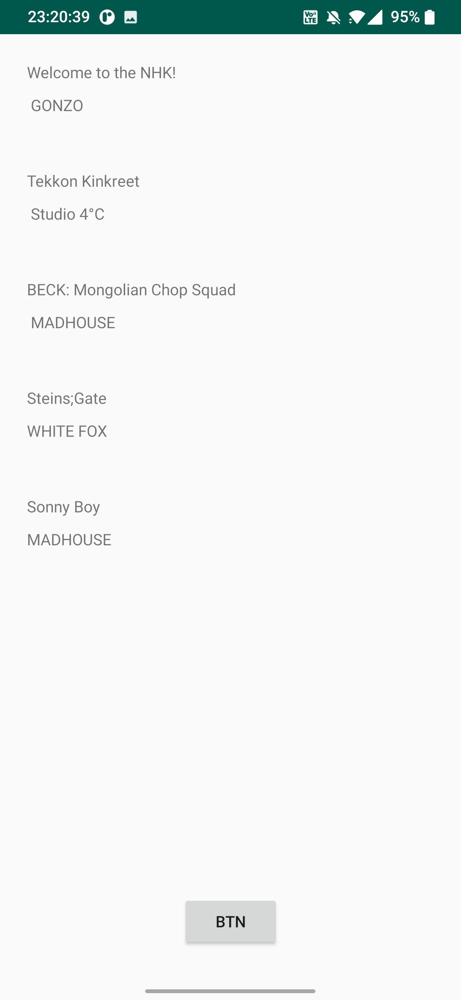
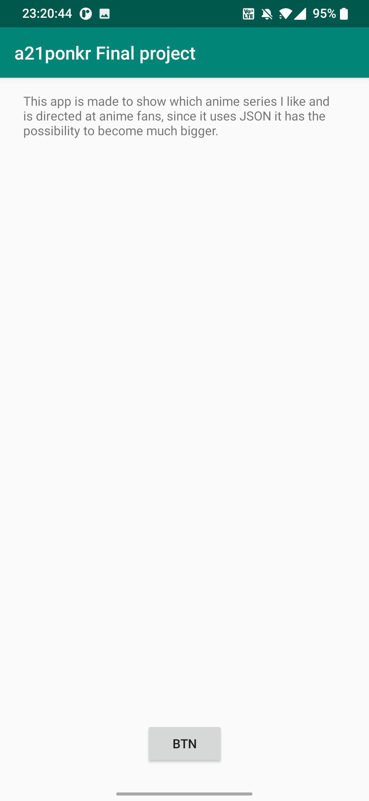

Det här projektet bygger på att sätta våra kunskaper på krav. Mitt projekt består av att visa animeserier 
jag gillar och jag har främst använt mig av deras namn och företag (studio) därmed har jag klassen Anime.java.

JSON-datan skrevs in på en hemsida och hämtades också därifrån, de använde flera olika taggar så som:
ID, Login, Size, Location, Name, company, category och Auxdata, de fanns redan där och kunde inte namnges annorlunda på sidan. 

Min Anime.java består av:
Med strängar för id, namn och företag. "this" är ett nyckelord som hänvisar till det aktuella objektet.
Sen returnerar de strängarna

```
public class Anime {
    private String id;
    private String name;
    private String company;

    public Anime(String id, String name, String company) {
        this.id = id;
        this.name = name;
        this.company = company;
    }

    public String getId() {
        return id;
    }
    public String getName() {
        return name;
    }
    public String getCompany(){
        return company;
    }

}
```

och MainActivity används för att hämta JSON_länken, skapa en array och ansluta till recyclerviewen. Här finns det också så att man kan komma till den andra aktiviteten.

Kod:

```
public class MainActivity extends AppCompatActivity implements JsonTask.JsonTaskListener {

    private final String JSON_URL = "https://mobprog.webug.se/json-api?login=a21ponkr";
    private final String JSON_FILE = "mountains.json";
    private ArrayList<Anime> as;
    private RecyclerView recyclerView;
    private Button button;

    @Override
    protected void onCreate(Bundle savedInstanceState) {
        super.onCreate(savedInstanceState);
        setContentView(R.layout.activity_main);
        new JsonTask(this).execute(JSON_URL);
        new JsonFile(this, this).execute(JSON_FILE);

        button = (Button) findViewById(R.id.button);

        button.setOnClickListener(new View.OnClickListener() {
            @Override
            public void onClick(View view) {
                openActivity_about();
            }
        });
    }

    @SuppressLint("NotifyDataSetChanged")
    @Override
    public void onPostExecute(String json) {
        Log.d("MainActivity", json);
        Gson gson = new Gson();
        Type type = new TypeToken<ArrayList<Anime>>(){}.getType();
        as = gson.fromJson(json, type);
        RecyclerViewAdapter recyclerViewAdapter = new RecyclerViewAdapter(as);

        RecyclerView.LayoutManager layoutManager = new LinearLayoutManager(getApplicationContext());
        recyclerView = findViewById(R.id.recycler_view);
        recyclerView.setLayoutManager(layoutManager);
        recyclerView.setItemAnimator(new DefaultItemAnimator());
        recyclerView.setAdapter(recyclerViewAdapter);
    }

    public void openActivity_about(){
        Intent intent = new Intent(this, Activity_about.class);
        startActivity(intent);
    }

}
```

Den här bilden visar mainpage

Den här bilden visar aboutpage
